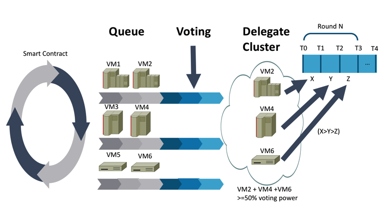
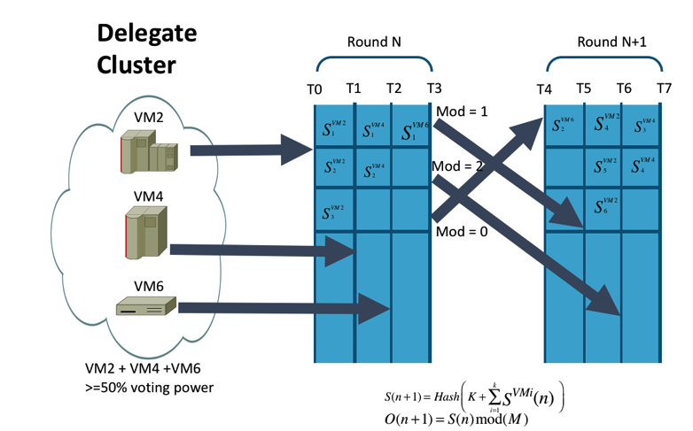

# VM-DPoSW, the Consensus Algorithm of BFDChain: The Design Principle and Quantitative Analysis
#  VM-DPoSW，BFDC的共识算法：设计原理和定量分析

Abstract In this paper, we discuss the design detail of VM-DPoSW, the consensus algorithm that supports a robust BFDChain under the DAOS ecosystem. The workflow, design principle, implementation and its controllability analysis are discussed in detail.

摘要：在本文中，我们讨论了VM-DPoSW的设计细节，这是在DAOS生态系统下支持强大BFDChain的一致性算法。详细讨论了工作流程，设计原则，实现及其可控性分析。、

## I. Introduction
## I. 介绍

As one of the most important aspects of any blockchain systems, the consensus algorithm design is crucial to construct a robust and health blockchain ecosystem. In BFDChain, we designed a new consensus algorithm named VM-DPoSW, which is a virtual machine based hybrid system with both Proof of Work (PoW) and Delegated Proof of Stake (DPoS) support.  

作为任何区块链系统最重要的方面之一，共识算法设计对于构建健壮的区块链生态系统至关重要。在BFDChain中，我们设计了一种名为VM-DPoSW的新共识算法，这是一种基于虚拟机的混合系统，具有工作证明（PoW）和委托证明（DPoS）支持.

The rest of this paper is organized as follows: In Section II, we present the state of art review of popular consensus algorithms. We then provide detailed technical discussion of VM-DPoSW and its controllability analysis in Section III and IV. Section IV includes concluding remarks of our design.  

本文的其余部分安排如下：在第二部分，我们介绍了流行的共识算法的现状。然后，我们在第III和IV节中提供VM-DPoSW及其可控性分析的详细技术讨论,第四节包括我们设计的结束语。  

## II. STATE OF ART OF CONSENSUS ALGORITHMS
## II. 共识算法的技术现状

A safe, orderly and healthy blockchain requires us to solve two fundamental problems: double spending and byzantine generals problem [8]. Double spending problem means to reuse the currency in two transactions simultaneously. Byzantine generals problem means during the peer to peer communication of the distributed system, some maliciously users may tamper the communication contents, thus lead to security breach or communication inconsistency.  

一个安全，有序和健康的区块链要求我们解决两个基本问题：双花和拜占庭将军问题[8]。双花问题意味着同时在两个交易中重复使用货币。拜占庭将军问题意味着在分布式系统的对等通信期间，一些恶意用户可能会篡改通信内容，从而导致安全漏洞或通信不一致。

In order to make the whole blockchain safe and consistent, the generation of block needs to reach a certain consensus, thus the consensus algorithm is one of the keys for any blockchain technologies. The common consensus algorithms are PoW, PoS, DPoS, PBFT, and RAFT.  

为了保证整个区块链的安全和一致，区块的生成需要达成一定的共识，因此共识算法是任何区块链技术的关键之一。常见的一致性算法是PoW，PoS，DPoS，PBFT和RAFT。

**PoW (Proof of Work):** The workload proof mechanism, through a large number of HASH operations, calculates a suitable random number and produces a new block. And this is the safest way of security, but at the same time, it is also very energy consuming. Bitcoin [1] is the most typical PoW implementation.  

**PoW (Proof of Work):** 工作量证明机制通过大量HASH操作计算合适的随机数并生成新块。这是最安全的安全方式，但与此同时，它也非常耗能。比特币[1]是最典型的PoW实现。

**PoS (Proof of Stake):** The ownership proof mechanism, through the holding amount and holding time of the token, reduces the difficulty of the block production. This method solves the problem of energy consumption comparing with PoW, but there are certain bottlenecks in security, and system bifurcation is easy to appear. PPCoin [6] is one typical PoW implementation.  

**PoS (Proof of Stake):** 所有权证明机制，通过令牌的持有量和持有时间，降低了区块生产的难度。该方法与PoW相比解决了能耗问题，但安全性存在一定的瓶颈，容易出现系统分叉。 PPCoin [6]是一种典型的PoW实现.
 
**DPoS (Delegated Proof of Stake):** The agent's equity proof mechanism, by which a certain number of agents are elected by the ballot papers, and the blocks are produced in a certain order between the agents. DPoS greatly reduces the number of verification node and improves transaction confirmation speed under the premise of security protection. However, the corresponding centralization degree is reduced. BitShares is an example of DPoS [2].  

**DPoS (Delegated Proof of Stake):** 代理人的股权证明机制，通过选票选出一定数量的代理人，并且代理人之间按照一定的顺序生成股票。 DPoS在安全保护的前提下，大大减少了验证节点的数量，提高了事务确认速度。但是，相应的集中度降低了。 BitShares是DPoS的一个例子[2]

**PBFT (Practical Byzantine Fault Tolerance):** It is a practical Byzantine fault tolerance, and this kind of consensus cannot require the issuance of tokens, which is more suitable for the operation of the alliance chain. In 1999, the PBFT system [7][8] was proposed and the algorithm complexity was reduced to a polynomial level, which greatly improved efficiency. PBFT have 5 steps in its workflow, namely, 1)request, 2)pre-prepare, 3)prepare, 4)commit and 5)reply.  

**PBFT (Practical Byzantine Fault Tolerance):** 这是一种实用的拜占庭容错，而这种共识不能要求发行令牌，这更适合联盟链的运作。 1999年，提出了PBFT系统[7] [8]，并将算法复杂度降低到多项式水平，大大提高了效率。 PBFT在其工作流程中有5个步骤，即1）请求，2）预备，3）准备，4）提交和5）回复。

**RAFT:** To solve the consistency problem in PBFT, Lamport etc. proposed a new algorithm named Paxos, which is the initial prototype of RAFT. It was not until 2013 for RAFT algorithm to be formally proposed by Ongaro etc. in [9]. RAFT achieves the same effect as Paxos and is more convenient in engineering implementation and understanding.  

**RAFT:** 为了解决PBFT中的一致性问题，Lamport等人提出了一种名为Paxos的新算法，它是RAFT的初始原型。直到2013年，RAFT算法才由Ongaro等在[9]中正式提出。 RAFT实现与Paxos相同的效果，在工程实施和理解方面更加方便。

For a specific business scenario, the consensus algorithm has a great impact on the participants' decisions. For the alliance chain with certain trust basis, most of them take PBFT as the first choice, and the PBFT consensus mechanism performs better when nodes are fixed and the number of nodes is less. In the low dependence environment, the robustness of the blockchain system is generally guaranteed by PoW, PoS, and DPoS.  

对于特定的业务场景，一致性算法对参与者的决策有很大影响。对于具有一定信任基础的联盟链，大多数以PBFT为首选，当节点固定且节点数较少时，PBFT共识机制表现更好。在低依赖性环境中，区块链系统的稳健性通常由PoW，PoS和DPoS保证。

## III. BFDT PROXY VIRTUAL MACHINE (BPVM) CONSENSUS ALGORITHM

## III. BFDT代理虚拟机（BPVM）共识算法

BFDChain serves the main chain for Befund’s decentralized fund service platform for operating activities that are far more complex than that of Bitcoin and Ethereum. Thus, our goal is to design an efficient and robust consensus algorithm to support a sustainable and healthy eco-system.  

BFDChain为Befund的分散式基金服务平台提供主链，其运营活动远比比特币和以太坊复杂。因此，我们的目标是设计一种有效且稳健的共识算法，以支持可持续和健康的生态系统。

We use virtual machine based hybrid DPoS and PoS (VM-DPoSW) consensus algorithm to achieve our design goal. Here is the implementation detail of VMDPoSW:  

我们使用基于虚拟机的混合DPoS和PoS（VM-DPoSW）一致性算法来实现我们的设计目标。以下是VMDPoSW的实现细节：

### 3.1 Virtual Machine

### 3.1 虚拟机

Virtual Machines (VMs) are the abstract entities that perform mining work on BFDChain. VMs serve two purposes: first, they are the mining worker to solve the hash computing for the proof of work (PoW). Secondly, they are the delegates that represent the share stake of the shareholders of BFDT in the BFDChain eco-system (DPoS). To achieve this, VMs are created by smart contacts to have different computing powers, and the total number of the VMs are upper bounded in a given period of time based on supply and demands. BFDT Shareholders such as side chain owner, decentralized application developer, investors acquire the VMs with different computing power via bidding with BDFT. As VMs are the only eligible miners on the BFDChain ecosystem, and higher computing power represent higher voting right, the BFDT shareholders are incentive to invest on VMs and have BFDT locked in the BFDChain ecosystem to achieve stable and healthy long-term growth.

虚拟机（VM）是在BFDChain上执行挖掘工作的抽象实体。虚拟机有两个目的：首先，它们是挖掘工作者，用于解决工作证明（PoW）的哈希计算。其次，他们是代表BFDT股东在BFDChain生态系统（DPoS）中的股份。为实现此目的，VM由智能联系人创建以具有不同的计算能力，并且VM的总数基于供应和需求在给定的时间段内的上限。 BFDT股东，如侧链所有者，分散应用程序开发商，投资者通过与BDFT的竞标获得具有不同计算能力的VM。由于VM是BFDChain生态系统中唯一合格的矿工，并且更高的计算能力代表更高的投票权，因此BFDT股东有动力投资VM并将BFDT锁定在BFDChain生态系统中以实现稳定和健康的长期增长。

### 3.2 Why VM-DPoSW?

### 3.2 为何选择VM-DPoSW？

In the original design of PoW, it is the hope of the designer that all mining workers can use the CPU to perform the mining work such that each node, even with different computing power (thus different hashing power), still has the equal opportunity to participate in the decision-making of the blockchain. However, with the development of the hardware such as GPUs and ASICs, and the aggregation of individual computing power into mining pools, the ordinary miners rarely have the opportunity to create a block. Furthermore, there are more and more criticize of PoW not being environment friendly and slowing down transaction speed on blockchain.  

在PoW的原始设计中，设计人员希望所有采矿工人都可以使用CPU来执行采矿工作，使得每个节点，即使具有不同的计算能力（因此具有不同的散列能力），仍然具有相同的机会参与区块链的决策。然而，随着诸如GPU和ASIC之类的硬件的发展以及将个体计算能力聚合到采矿池中，普通矿工很少有机会创建块。此外，越来越多的批评指出PoW不是环境友好的，并且减缓了区块链的交易速度。

On the other side, the DPoS mechanism such as BitShares tries to tackle the problem of PoW by allowing each node to select the delegates based on its share stake. The top N delegates that have got the most votes have the accounting right. The sufficient decentralization is achieved as long as 50% of the voting shareholders believe their delegates are part of the delegates group that can perform the block creation and validation work [3]. Generally, the blockchain using DPoS is more efficient and powersaving than PoW because all of the blocks creation and validation occurred only on a group of delegates. Yet, there are more and more criticize from the community that pure DPoS only represents the interest of the large shareholders, and the small and medium shareholders rarely have the rights in the block chain decision making process.

另一方面，BitShares等DPoS机制试图通过允许每个节点根据其份额来选择代表来解决PoW问题。获得最多选票的前N名代表拥有会计权。只要50％的投票股东认为他们的代表是可以执行区块创建和验证工作的代表组的一部分，就可以实现充分的分权[3]。通常，使用DPoS的区块链比PoW更有效和省电，因为所有块创建和验证仅发生在一组代表上。然而，社会上越来越多的批评认为，纯粹的DPoS只代表大股东的利益，而中小股东很少拥有区块链决策过程中的权利。

The drawbacks of PoW and DPoS motivate us to come up VM-DPoSW, to balance the pros and cons of PoW and DPoS, for a stable, robust, and efficient consensus design.

PoW和DPoS的缺点促使我们推出VM-DPoSW，以平衡PoW和DPoS的优缺点，实现稳定，稳健，高效的共识设计。

### 3.3 How Does VM-DPoSW work?
### 3.3 VM-DPoSW 如何工作？

We will use the Fig.1 to illustrate how VM-DPoSW works. 

我们利用图片1来描述VM—DPoSW如何工作。

a. Create Virtual Machines 创建虚拟机

First, after a successful biding, the smart contracts on BFDChain are triggered to create virtual machines (VMs) that fall into different categories of computing power. For better illustration, we simplify the model to assume there are only three types of VMs: gold (large computing power), silver (medium computing power), and bronze (small computing power). The computing power of each type is designed such that gold > silver > bronze, i.e.,  

首先，在成功绑定之后，触发BFDChain上的智能合约以创建属于不同类别计算能力的虚拟机（VM）。为了更好地说明，我们简化模型以假设只有三种类型的VM：黄金（大计算能力），银（中等计算能力）和青铜（小计算能力）。每种类型的计算能力设计为金>银>青铜，即：

$$ VM_2^{gold} > VM_4^{silver} > VM_6^{bronze} \tag 1$$

b. Queue Pool 队列池

Let’s further assume the newly created virtual machines VM1/2, VM3/4, and VM5/6 belong to gold, silver, and bronze respectively. Right after VMs are created, their role is initially set as witness role, and are put into the queue pool as the delegate candidate.

让我们进一步假设新创建的虚拟机VM1/2，VM3/4和VM5/6分别属于金，银和铜。在创建VM之后，它们的角色最初设置为见证角色，并作为委托候选者放入队列池中。

c. Voting and Delegate Cluster 投票和代理集群
Sequentially, when the new transaction requests come, new smart contract is triggered to evaluate whether the delegate cluster pool has sufficient delegates to complete the transaction requests. If not, voting process is triggered to select additional witness from the queue pool to the delegate cluster pool. In our scenario, let’s assume VM2 of gold type, VM4 of silver type, and VM6 of bronze type are selected as delegates and put into the delegate cluster pool, and they fulfill the requirements that 

顺序地，当新的事务请求到来时，触发新的智能合约以评估委托集群池是否具有足够的委托来完成事务请求。如果不是，则触发投票过程以从队列池中选择附加见证到代理群集池。在我们的场景中，假设选择黄金类型的VM2，银类型的VM4和青铜类型的VM6作为代理并放入代理群集池，它们满足要求:

$$VM_2^{gold} + VM_4^{silver} + VM_6^{bronze} \geq 50\%VotingPower \tag 2$$

d. Transation Process 事务处理
In VM-DPoSW, the transaction requests are processed in different “rounds” in the time spectrum, and in each “round”, the hash difficulty is the same for all delegates. In our case, as illustrated in Fig.1，the round N starts at T0, and is expected to end at T3. Our algorithm is designed in the way that the total time in round N, ΔT = T 3− T 0 , is equally divided into K slides, where K is the total number of delegates in the delegates cluster, i.e.,  

在VM-DPoSW中，交易请求在时间谱中的不同“轮次”中被处理，并且在每个“轮”中，所有代表的散列难度是相同的。在我们的例子中，如图1所示，轮次N从T0开始，预计在T3结束。我们的算法的设计方式是将第N轮中的总时间ΔT = T3 - T0等分为K个幻灯片，其中K是代表群中代表的总数，即  

$$ T1 - T0 = T2 - T1 = T3 - T2 = ΔT/3 \tag 3$$  

Let’s assume VM2 in gold type starts to serve the transaction request at T0 and stopped at T1 (the order may be different, and we will address the ordering in section 3.4). Within ΔT / 3 time frame, VM2 processed X number of transaction requests. Same scenario applies to VM4 and VM6 at T1 and T2, and each processed Y and Z number of transaction requests within ΔT / 3 time frame. Recall in terms of computing power, we have (1), and the hash difficulty is the same for all delegates in round N, thus we will have $ X > Y > Z \tag 4$  

假设黄金类型的VM2开始在T0处为交易请求提供服务并在T1处停止（订单可能不同，我们将在3.4节中解决这个问题）。在ΔT/ 3时间范围内，VM2处理了X个事务请求。相同的情况适用于T1和T2处的VM4和VM6，以及每个处理的Y和Z数量的交易请求在ΔT/ 3时间范围内。回想一下计算能力，我们有（1），并且散列难度对于N轮中的所有代表都是相同的，因此我们将得到 $ X > Y > Z \tag 4$ 

We can see from eq.(3) that VM-DPoSW gives each delegate an equal opportunity to participate the mining process regardless the computing power of the delegates. On the other hand, eq. (4) shows that the delegate with higher computing power will process more transaction requests (thus more blocks) and thus generate more rewards for the shareholder with higher share stake, even it was only given same process time comparing with other delegates with lower computing power. In reality, we will put more constraints to ensure a sophisticated delegates system. For example, we may set the upper bound for the percentage of VMs in each category.  

从方程（3）我们可以看出，无论代表的计算能力如何，VM-DPoSW都为每个代表提供了参与挖掘过程的平等机会。另一方面，eq。 （4）表明具有较高计算能力的代表将处理更多的交易请求（因此更多的块），从而为拥有更高股份的股东产生更多的奖励，即使与具有较低计算能力的其他代表相比，它只被给予相同的处理时间。实际上，我们会提出更多限制来确保复杂的代表系统。例如，我们可以设置每个类别中VM百分比的上限。

### 3.4 The signature and ordering of VM-DPoSW  

### 3.4 VM-DPoSW的签名和排序  

As pointed out in [4], in PoW, the expected time to calculate a correct “nonce” is proportional the hash difficulty. i.e., the nonce H must satisfy the relations:  

正如[4]中所指出的，在PoW中，计算正确“nonce”的预期时间与散列难度成正比。即，随机数H必须满足关系:

$$ n \leq \left(\frac{2^{256}}{H_d} \right)^m = H_m \tag 5 $$
$$\require{cancel}With^{(n,m) = PoW（H_{\cancel{n}},H_{n},d）}$$

Where n is the mix-hash and m is the pseudo-random number cryptographically depend on H and d. H is the new block’s header H without the nonce and mixhash components, and d is the current data set. PoW is the proof of work function. Eq.5 is the foundation of the security of the blockchain and is the fundamental reason why a malicious node cannot propagate newly create blocks that would otherwise overwrite history.  

其中n是mix-hash，m是伪随机数，密码依赖于H和d。 H是没有nonce和mixhash组件的新块头，         $\require{cancel}H_{\cancel{n}}$，而d是当前数据集。 PoW是工作功能的证明。方程5是区块链安全性的基础，也是恶意节点无法传播新的创建块的根本原因，否则会覆盖历史记录。  

In VM-DPoSW, however, we may choose to set the hash difficulty lower so that even the VM with lowest computing power can finish the hash computing quickly and can generate new block and process transactions in its given time window. While this design significantly increases the efficiency of the eco-system, it may increase the security vulnerability as malicious users may take advantage of the lower hash difficulty. This requires us to add additional security mechanism, namely, signature and random ordering, to safeguard the BFDChain ecosystem.  

但是，在VM-DPoSW中，我们可以选择将散列难度设置得更低，以便即使具有最低计算能力的VM也可以快速完成散列计算，并且可以在给定时间窗口内生成新的块和进程事务。虽然这种设计显着提高了生态系统的效率，但它可能会增加安全漏洞，因为恶意用户可能会利用较低的散列难度。这需要我们添加额外的安全机制，即签名和随机排序，以保护BFDChain生态系统。  

The design goal of the signature and random ordering is to ensure a given delegate VM in the delegate cluster can only process transaction request in the assigned “round” as well as the assigned time window. As illustrated in Fig.2., assume in round N, VM2 starts to perform the mining and create a new block at T0, we add a private key into the optional filed of the block and got a signature $ S_{1}^{vm2}$ by performing
$$ S_1^{vm2} = Hash(K_1^{vm2}) \tag 6$$

